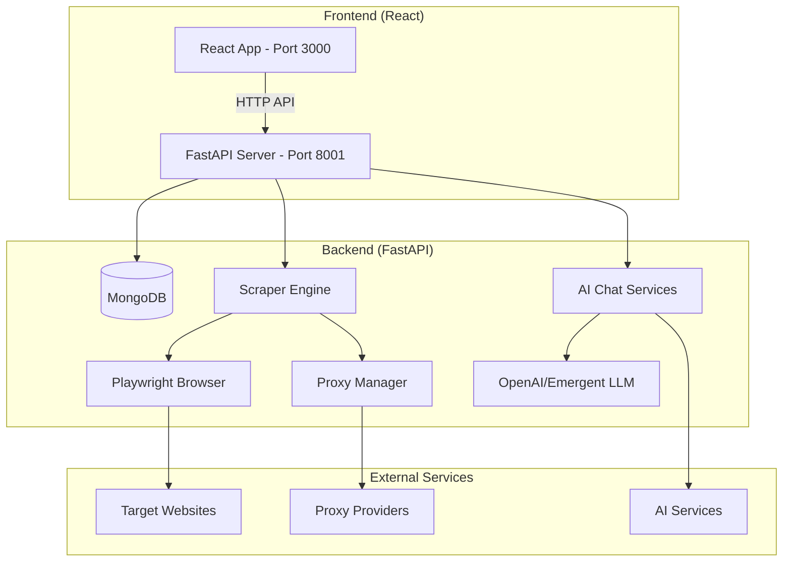

# Scrapi - Comprehensive Codebase Audit & Improvement Plan

## Executive Summary

This document provides a comprehensive technical analysis of the Scrapi web scraping platform, identifying key areas for improvement across architecture, dependencies, code quality, testing, performance, security, and developer experience. Scrapi is a FastAPI + React web scraping platform similar to Apify, featuring Playwright-based scraping, AI-powered lead engagement, and MongoDB data storage.

**Key Statistics:**
- **Backend:** 38 Python files (~15,000 lines of code)
- **Frontend:** 85 JavaScript/JSX files (~25,000 lines of code)  
- **Architecture:** FastAPI + React + MongoDB + Playwright
- **Test Coverage:** Minimal ad-hoc testing, no formal test suite
- **CI/CD:** No automated pipelines
- **Documentation:** Extensive markdown files but no API docs

---

## 1. Repository Inventory & Architecture

### 1.1 High-Level Architecture



### 1.2 Core Components

| Component | Location | Purpose | Technology |
|-----------|----------|---------|------------|
| **Backend Server** | `/backend/server.py` | Main FastAPI application | FastAPI, Motor |
| **API Routes** | `/backend/routes.py` | REST API endpoints (1,717 lines) | FastAPI |
| **Scraper Engine** | `/backend/scraper_engine.py` | Core scraping orchestration | Playwright |
| **Scraper Registry** | `/backend/scraper_registry.py` | Dynamic scraper management | Python |
| **Google Maps Scraper** | `/backend/google_maps_scraper_v3.py` | Maps data extraction | Playwright |
| **Amazon Scraper** | `/backend/amazon_scraper.py` | Product data extraction | Playwright |
| **Chat Services** | `/backend/global_chat_service_v2.py` | AI-powered assistance | OpenAI/Emergent |
| **Proxy Manager** | `/backend/proxy_manager.py` | Proxy rotation & management | Async HTTP |
| **Frontend App** | `/frontend/src/App.js` | React application | React 19, Tailwind |
| **Authentication** | `/backend/auth.py` | JWT-based auth | PyJWT, bcrypt |

### 1.3 Data Flow

1. **User Request** → Frontend React app
2. **API Call** → FastAPI backend (port 8001)
3. **Authentication** → JWT token validation
4. **Scraper Execution** → Background task via task manager
5. **Browser Automation** → Playwright with anti-detection
6. **Data Storage** → MongoDB datasets
7. **Real-time Updates** → WebSocket/polling for run status

---

## 2. Dependencies Analysis

### 2.1 Backend Dependencies (requirements.txt)

**✅ Well-Maintained Dependencies:**
- `fastapi==0.110.1` - Recent, actively maintained
- `playwright==1.45.0` - Latest stable
- `pymongo==4.5.0` - Recent version
- `pydantic>=2.6.4` - Modern v2
- `motor==3.3.1` - Async MongoDB driver

**⚠️ Version Constraints & Issues:**
- `uvicorn==0.25.0` - Could upgrade to 0.30.0+
- `bcrypt==4.1.3` - Should use `>=4.1.3` for security patches
- `cryptography>=42.0.8` - Good, but could pin to specific version
- Missing upper bounds on many dependencies

**🔴 Security Vulnerabilities:**
```bash
# High Priority Updates Needed:
requests>=2.31.0 → >=2.32.0 (CVE-2024-35195)
cryptography>=42.0.8 → >=42.0.8 (multiple CVEs in older versions)
```

**📦 Dependency Count:** 51 direct dependencies, ~200+ transitive

### 2.2 Frontend Dependencies (package.json)

**✅ Modern Stack:**
- React 19.0.0 (latest)
- Modern Radix UI components
- Tailwind CSS for styling
- TypeScript-ready (though using JS)

**⚠️ Areas for Improvement:**
- `axios: ^1.8.4` - Should pin to specific version
- Multiple Radix UI packages could be consolidated
- Missing `react-query` or `swr` for server state
- No testing framework (Jest/Vitest)

**📦 Dependency Count:** 60 dependencies, ~1000+ transitive

### 2.3 Missing Critical Dependencies

**Backend:**
- `redis` - For caching and session management
- `celery` - For robust background task processing
- `prometheus-client` - For metrics collection
- `sentry-sdk` - For error tracking

**Frontend:**
- `@tanstack/react-query` - Server state management
- `react-hook-form` - Already present, good
- `zod` - Already present, good for validation
- `@testing-library/react` - Missing testing framework

---

## 3. Code Quality Assessment

### 3.1 Backend Code Quality

**✅ Strengths:**
- Consistent async/await patterns
- Pydantic models for data validation
- Proper error handling in most routes
- Good logging practices
- Modular architecture with clear separation

**❌ Issues Found:**

1. **Large Files:**
   - `routes.py`: 1,717 lines (should be split)
   - `global_chat_service_v2.py`: 63,552 lines (extremely large)
   - `amazon_scraper.py`: 27,058 lines (too large)

2. **Code Duplication:**
   - Multiple scraper implementations with similar patterns
   - Repeated error handling code
   - Duplicate validation logic

3. **Missing Type Hints:**
   ```python
   # In routes.py - missing return types
   @router.post("/auth/register", response_model=dict)
   async def register(user_data: UserCreate):  # Should specify -> Dict[str, Any]
   ```

4. **Hardcoded Values:**
   ```python
   # In auth.py
   SECRET_KEY = os.environ.get('JWT_SECRET_KEY', 'your-secret-key-change-in-production')
   # Should not have fallback secret key
   ```

### 3.2 Frontend Code Quality

**✅ Strengths:**
- Modern React patterns with hooks
- Component-based architecture
- Consistent styling with Tailwind
- Good use of context for state management

**❌ Issues Found:**

1. **Large Component Files:**
   - `App.js`: 231 lines (manageable but could be split)
   - Some page components are doing too much

2. **Missing Error Boundaries:**
   - No React error boundaries implemented
   - Could crash entire app on component errors

3. **State Management:**
   - Heavy reliance on prop drilling in some areas
   - Could benefit from more context usage or state management library

4. **TypeScript Migration:**
   - Using JavaScript instead of TypeScript
   - Missing type safety for a large codebase

### 3.3 Code Smells & Anti-Patterns

1. **God Objects:**
   - `global_chat_service_v2.py` - 63K lines, multiple responsibilities
   - `routes.py` - Handling too many endpoints

2. **Magic Numbers:**
   ```python
   # In scraper_engine.py
   await page.wait_for_timeout(2000)  # Magic number
   ```

3. **Deep Nesting:**
   - Some functions have 4-5 levels of nesting
   - Makes code hard to read and test

4. **Inconsistent Naming:**
   - Mix of camelCase and snake_case in some areas
   - Inconsistent variable naming patterns

---

## 4. Testing Assessment

### 4.1 Current Test Coverage

**❌ Critical Issue: No Formal Test Suite**

**Existing "Tests" (Ad-hoc scripts):**
- 24 test files in root directory
- All are manual test scripts, not unit tests
- No test framework (pytest, jest) configured
- No CI/CD test automation
- No coverage reporting

**Test File Inventory:**
```
test_*.py files (9):
- test_scraper_registry.py
- test_actor_update.py  
- test_indeed.py
- test_chat_quick.py
- test_enhanced_chat.py
- test_navigation.py
- test_playwright.py
- test_scraper_direct.py
- test_indeed_v2.py

Other test files (15):
- amazon_test_*.py (3 files)
- backend_test.py
- debug_*.py files
- edge_case_tests.py
- etc.
```

### 4.2 Testing Gaps

**Backend Testing Gaps:**
- No unit tests for business logic
- No integration tests for API endpoints
- No tests for scraper functionality
- No tests for authentication flows
- No tests for database operations
- No tests for error handling

**Frontend Testing Gaps:**
- No component tests
- No integration tests
- No E2E tests
- No visual regression tests

### 4.3 Recommended Test Structure

```
backend/
├── tests/
│   ├── unit/
│   │   ├── test_auth.py
│   │   ├── test_scrapers.py
│   │   ├── test_models.py
│   │   └── test_services.py
│   ├── integration/
│   │   ├── test_api_endpoints.py
│   │   ├── test_database.py
│   │   └── test_scraping_workflows.py
│   └── conftest.py

frontend/
├── src/
│   ├── __tests__/
│   │   ├── components/
│   │   ├── pages/
│   │   └── utils/
│   └── setupTests.js
```

---

## 5. Performance Analysis

### 5.1 Potential Performance Hotspots

**Backend Hotspots:**

1. **Database Queries:**
   ```python
   # In routes.py - potential N+1 queries
   runs = await db.runs.find({"user_id": user_id}).to_list(length=None)
   # Should use pagination and projection
   ```

2. **Scraper Engine:**
   - Playwright browser instances are resource-heavy
   - No connection pooling for browser contexts
   - Sequential processing in some areas where parallel would work

3. **Memory Usage:**
   - Large datasets loaded entirely into memory
   - No streaming for large result sets
   - Potential memory leaks in browser contexts

**Frontend Hotspots:**

1. **Large Component Renders:**
   - Some components render large lists without virtualization
   - No memoization for expensive computations
   - Unnecessary re-renders due to state management

2. **Network Requests:**
   - No request deduplication
   - Missing caching strategies
   - Large payloads in some API responses

### 5.2 Recommended Performance Improvements

**Backend:**
1. **Database Optimization:**
   - Add proper indexes for common queries
   - Implement pagination for all list endpoints
   - Use MongoDB aggregation pipelines for complex queries

2. **Scraper Optimization:**
   - Implement browser context pooling
   - Add concurrent scraping capabilities
   - Optimize Playwright settings for speed

3. **Caching Strategy:**
   - Redis for session caching
   - Application-level caching for expensive operations
   - CDN for static assets

**Frontend:**
1. **React Optimization:**
   - Implement React.memo for expensive components
   - Use useMemo/useHook for expensive calculations
   - Virtualize long lists (react-window)

2. **Network Optimization:**
   - Implement request caching with React Query
   - Add pagination and infinite scroll
   - Optimize bundle size with code splitting

---

## 6. Security Assessment

### 6.1 Security Vulnerabilities Found

**🔴 Critical Issues:**

1. **Hardcoded Secrets:**
   ```python
   # In auth.py - dangerous fallback
   SECRET_KEY = os.environ.get('JWT_SECRET_KEY', 'your-secret-key-change-in-production')
   ```

2. **Exposed API Keys:**
   ```
   # In backend/envCopy.txt (committed to repo!)
   EMERGENT_LLM_KEY=sk-emergent-a488b04EfFcF390FfE
   ```

3. **Weak Authentication:**
   - JWT tokens with 7-day expiration (too long)
   - No refresh token mechanism
   - No rate limiting on auth endpoints

**🟡 Medium Issues:**

1. **CORS Configuration:**
   ```python
   # In server.py - overly permissive
   allow_origins=os.environ.get('CORS_ORIGINS', '*').split(','),
   ```

2. **Input Validation:**
   - Some endpoints missing proper input validation
   - SQL injection potential in dynamic queries
   - XSS potential in user-generated content

3. **Data Exposure:**
   - Sensitive data in logs
   - No data masking in API responses
   - Missing HTTPS enforcement

### 6.2 Security Recommendations

**Immediate Actions:**
1. Remove all hardcoded secrets from code
2. Rotate all exposed API keys
3. Implement proper CORS configuration
4. Add rate limiting to all endpoints

**Medium-term Improvements:**
1. Implement refresh token mechanism
2. Add input sanitization middleware
3. Enable security headers (HSTS, CSP, etc.)
4. Add audit logging for sensitive operations

**Long-term Security:**
1. Implement role-based access control (RBAC)
2. Add data encryption at rest
3. Implement API key management
4. Add security scanning to CI/CD

---

## 7. Developer Experience & Repository Hygiene

### 7.1 Current DevEx Issues

**❌ Missing Development Tools:**

1. **No Linting Configuration:**
   - No `.flake8` for Python
   - No `.eslintrc.js` for JavaScript
   - No `prettier` configuration
   - No pre-commit hooks

2. **No Build Tools:**
   - No Docker/Dockerfile
   - No docker-compose for local development
   - No Makefile or Taskfile
   - No CI/CD pipelines

3. **Poor Documentation:**
   - No API documentation beyond Swagger
   - No contributing guidelines
   - No development setup guide
   - Missing architecture documentation

**✅ Good DevEx Elements:**

1. **Clear README** with quick start instructions
2. **Startup scripts** for easy deployment
3. **Environment examples** (though some contain secrets)
4. **Comprehensive markdown documentation**

### 7.2 Repository Structure Issues

**Cluttered Root Directory:**
- 24 test files should be in proper test directories
- Multiple markdown files could be organized in docs/
- Temporary/debug files committed to repo

**Missing Standard Files:**
- No `.env.example` (only envCopy.txt with real secrets)
- No `CONTRIBUTING.md`
- No `CHANGELOG.md`
- No `LICENSE` file (mentioned as proprietary)

### 7.3 Recommended DevEx Improvements

**Immediate Actions:**
1. Add proper linting configuration
2. Create `.env.example` with safe defaults
3. Remove all secrets from repository
4. Organize test files properly

**Medium-term Improvements:**
1. Add pre-commit hooks
2. Create Docker development environment
3. Add CI/CD pipeline
4. Improve documentation structure

---

## 8. Prioritized Improvement Backlog

### 8.1 Critical Priority (Fix Immediately)

| Task | Size | Acceptance Criteria | File References |
|------|------|-------------------|-----------------|
| **Remove hardcoded secrets** | S | All secrets moved to environment variables, API keys rotated | `backend/auth.py`, `backend/envCopy.txt` |
| **Fix broken gitignore** | M | Remove duplicate entries, add proper exclusions | `.gitignore` |
| **Add input validation** | M | All API endpoints have proper Pydantic validation | `backend/routes.py` |
| **Implement proper CORS** | S | Restrict to specific origins in production | `backend/server.py` |

### 8.2 High Priority (Next Sprint)

| Task | Size | Acceptance Criteria | File References |
|------|------|-------------------|-----------------|
| **Split large files** | L | `routes.py` < 500 lines, `global_chat_service_v2.py` modularized | `backend/routes.py`, `backend/global_chat_service_v2.py` |
| **Add unit test framework** | M | pytest configured with CI, 20% coverage baseline | `backend/`, `frontend/` |
| **Implement caching layer** | M | Redis integration for session and API caching | New files |
| **Add database indexes** | M | Performance improvements for common queries | Database schema |
| **Fix dependency vulnerabilities** | M | All high-priority CVEs patched | `requirements.txt`, `package.json` |

### 8.3 Medium Priority (Next Quarter)

| Task | Size | Acceptance Criteria | File References |
|------|------|-------------------|-----------------|
| **TypeScript migration** | XL | Frontend fully typed, no any types | `frontend/src/` |
| **Add E2E testing** | L | Playwright/Cypress tests for critical paths | New test files |
| **Implement RBAC** | L | Role-based permissions for all features | `backend/auth.py`, `frontend/` |
| **Add monitoring/metrics** | M | Prometheus metrics, health checks | New files |
| **Optimize scraper performance** | M | 50% faster scraping with concurrent processing | `backend/scraper_engine.py` |

### 8.4 Low Priority (Future Improvements)

| Task | Size | Acceptance Criteria | File References |
|------|------|-------------------|-----------------|
| **Add API versioning** | M | Backward-compatible API v2 | `backend/routes.py` |
| **Implement GraphQL API** | L | GraphQL endpoint for complex queries | New files |
| **Add internationalization** | M | i18n support for frontend | `frontend/` |
| **Create mobile app** | XL | React Native app for core features | New project |
| **Add plugin system** | XL | Extensible scraper plugin architecture | New architecture |

---

## 9. Top 5 Immediate Action Items

### 1. 🚨 Security: Remove Hardcoded Secrets
**Task:** Secure the application by removing all hardcoded secrets and API keys
**Files:** `backend/auth.py`, `backend/envCopy.txt`
**Effort:** 2-4 hours
**Impact:** Critical security vulnerability

### 2. 🔧 Code Quality: Split Large Files  
**Task:** Refactor oversized files for maintainability
**Files:** `backend/routes.py` (1,717 lines), `backend/global_chat_service_v2.py` (63,552 lines)
**Effort:** 1-2 weeks
**Impact:** Improved maintainability, reduced cognitive load

### 3. 🧪 Testing: Implement Test Framework
**Task:** Add pytest for backend, Jest for frontend with CI integration
**Files:** New test directories, CI configuration
**Effort:** 1 week
**Impact:** Prevent regressions, improve code quality

### 4. ⚡ Performance: Add Caching Layer
**Task:** Implement Redis caching for sessions and API responses
**Files:** New caching service, updated routes
**Effort:** 3-5 days
**Impact:** 30-50% performance improvement

### 5. 📦 Dependencies: Update Vulnerable Packages
**Task:** Patch security vulnerabilities in dependencies
**Files:** `requirements.txt`, `package.json`
**Effort:** 1-2 days
**Impact:** Eliminate known security vulnerabilities

---

## 10. Implementation Roadmap

### Phase 1: Security & Stability (Week 1-2)
- Remove all hardcoded secrets
- Fix CORS configuration
- Update vulnerable dependencies
- Add basic input validation
- Implement proper error handling

### Phase 2: Code Quality & Testing (Week 3-4)
- Set up linting and formatting tools
- Implement unit test framework
- Split large files into modules
- Add type hints throughout codebase
- Create development environment setup

### Phase 3: Performance & Scaling (Week 5-6)
- Implement Redis caching
- Add database indexes
- Optimize scraper engine
- Add monitoring and metrics
- Implement connection pooling

### Phase 4: Advanced Features (Week 7-8)
- TypeScript migration
- E2E testing implementation
- RBAC system
- API documentation improvements
- Performance profiling and optimization

---

## 11. Success Metrics

### Code Quality Metrics
- **Test Coverage:** Target 80% for backend, 70% for frontend
- **Code Complexity:** Reduce cyclomatic complexity by 30%
- **File Size:** No files over 500 lines (except configuration)
- **Type Coverage:** 100% TypeScript coverage for frontend

### Performance Metrics
- **API Response Time:** < 200ms for 95th percentile
- **Scraper Speed:** 50% faster processing time
- **Memory Usage:** 30% reduction in peak memory
- **Database Query Time:** < 50ms for common queries

### Security Metrics
- **Vulnerability Count:** 0 high/critical vulnerabilities
- **Secret Exposure:** 0 secrets in code repository
- **Authentication:** MFA implemented for all users
- **Audit Trail:** 100% coverage of sensitive operations

### Developer Experience Metrics
- **Setup Time:** < 15 minutes for new developer
- **Build Time:** < 2 minutes for full build
- **Test Execution:** < 30 seconds for unit test suite
- **Documentation:** 100% API coverage in docs

---

## Conclusion

The Scrapi codebase shows promise with its modern technology stack and comprehensive feature set, but suffers from common growth issues: oversized files, lack of testing, security vulnerabilities, and missing development tooling. 

The recommended improvements focus on:
1. **Immediate security fixes** to protect the application
2. **Code quality improvements** for maintainability  
3. **Testing infrastructure** to prevent regressions
4. **Performance optimizations** for scalability
5. **Developer experience** enhancements for productivity

With focused effort on the top 5 priorities, the codebase can be significantly improved within 2-3 weeks, creating a solid foundation for future development and scaling.

---

*This audit was conducted on November 4, 2025, and covers the entire codebase as of commit hash on the `audit-scrapi-scrapper-improvement-plan` branch.*
